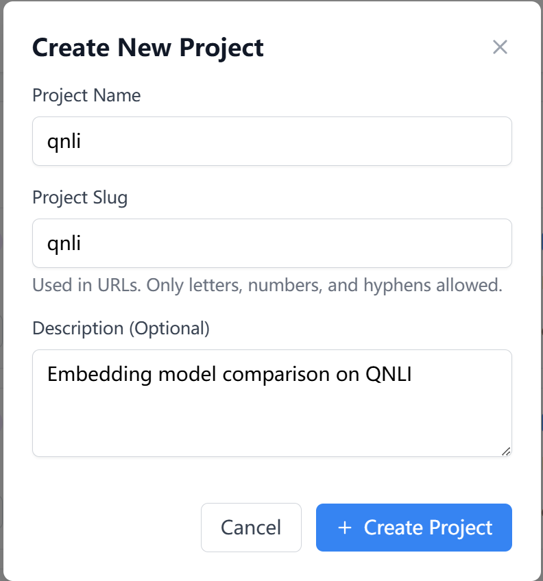
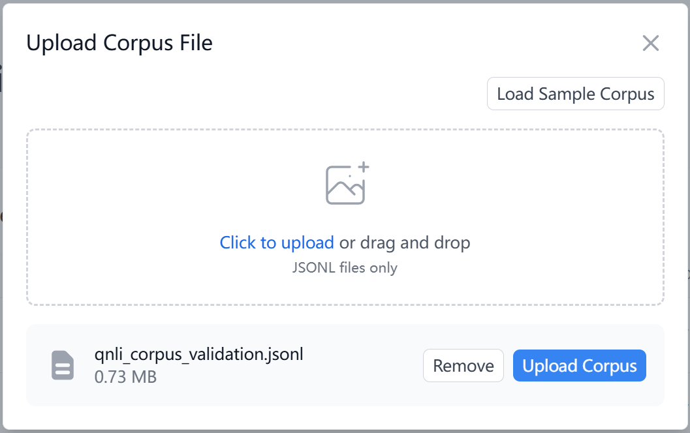
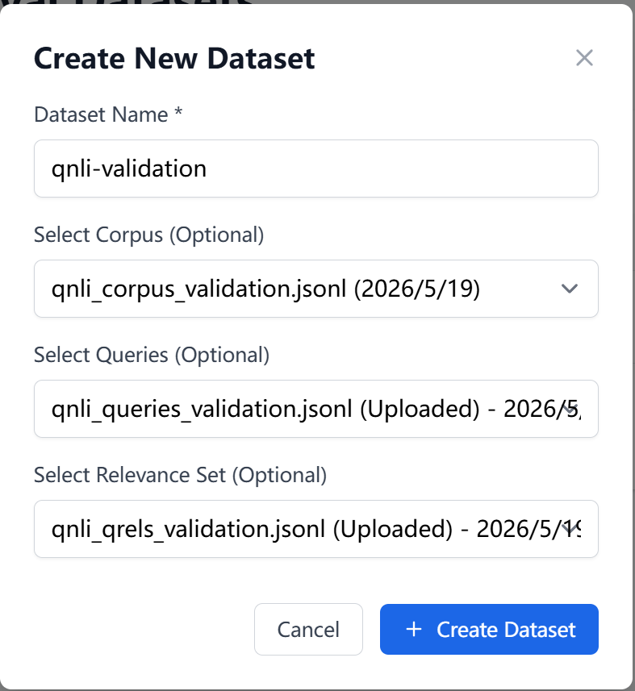
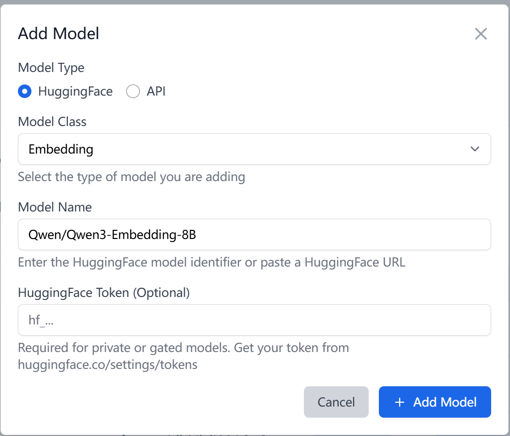
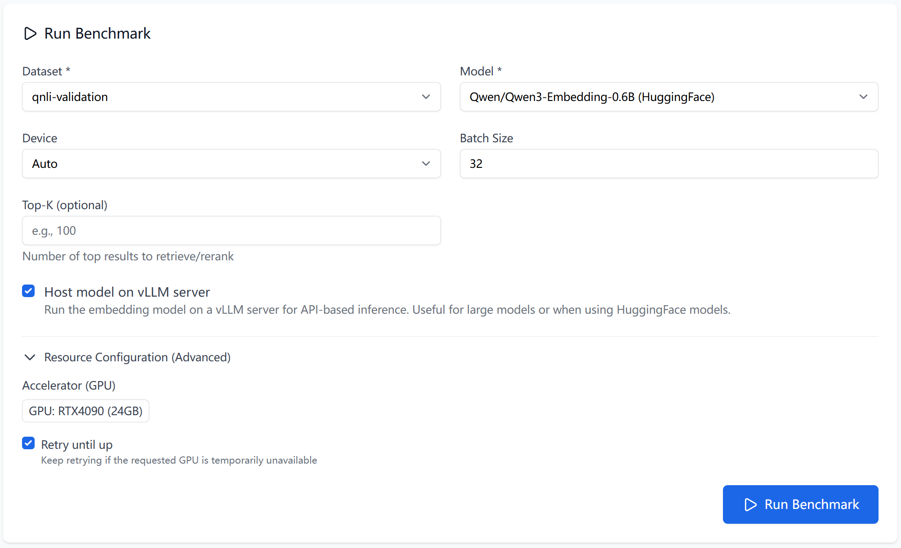
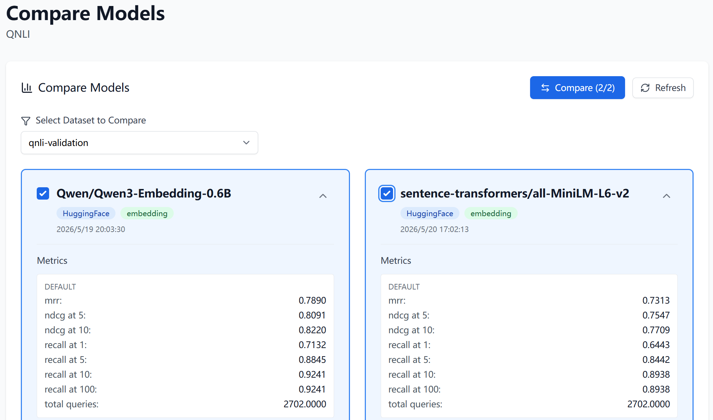

# How to choose your embedding model?

## 1. Introduction

Retrieval works by turning every query and document into a vector with an
**embedding model**, then ranking documents by how close their vectors sit to
the query's. The model alone decides what counts as "similar", so it sets the
ceiling on retrieval quality: a model that fits your domain surfaces the right
documents, while a poor fit buries them under irrelevant results.

Two embedding models can score very differently on the same data — the only
reliable way to pick one is to **measure** candidates on a dataset that
resembles your real workload.

This recipe does exactly that. You will:

- Create a project to hold the comparison.
- Upload a labelled retrieval dataset — here, **QNLI**.
- Add the embedding models you want to compare.
- Run a benchmark for each one.
- Compare the scores and pick a winner.

When you finish you will have a metrics table — **NDCG@10**, **Recall@10**,
**MRR**, and more — that shows which model retrieves best on your data.

## 2. Create a new project

1. On the dashboard (`/`), click **New Project**.
2. In the **Create New Project** dialog, fill in:
   - **Project Name** — `qnli`
   - **Project Slug** — `qnli` (used in URLs; letters, numbers, and hyphens
     only)
   - **Description (Optional)** — for example, `Embedding model comparison on QNLI`
3. Click **Create Project**. You land on the project overview at
   `/project/{id}`.



## 3. Upload the dataset

To compare embedding models you have to measure how well each one retrieves,
and that needs a **labelled dataset**: a set of queries, each paired with the
chunks that should be retrieved for it. In Tuner a dataset is three JSONL
files — a **corpus**, a **query** set, and a **relevance set** — combined
under one name.

> **Tip — no labelled dataset yet?** Two ways to get one:
>
> - **Collect real labels** — hire annotators, or gather feedback from your
>   existing search system (clicks, ratings, manual relevance judgements).
> - **Synthesize one from your corpus** — generate queries and relevance
>   labels automatically. See the recipe
>   [How to synthesize a dataset](How-to-synthesize-a-dataset).

For this recipe we use **QNLI** (Question-answering Natural Language
Inference), which converts cleanly into a retrieval task: each question has a
known answer sentence, so questions become **queries**, sentences become the
**corpus**, and the question-to-answer links become the **relevance set**.

Download a ready-made QNLI dataset —
[qnli.zip](assets/how-to-choose-your-embedding-model/qnli.zip) — which unpacks
into the three `.jsonl` files (one JSON object per line). Then upload each in
the steps below.

### 3.1 Upload the corpus

Go to **Files → Corpus Files** (`/project/{id}/files/corpus`), click
**Upload**, choose your `.jsonl` file in the **Upload Corpus File** dialog, and
click **Upload Corpus**.

Each line is one document chunk:

```json
{"id": "doc-001", "text": "This is the first document chunk"}
```



### 3.2 Upload the queries

Go to **Files → Query Files** (`/project/{id}/files/queries`), click
**Upload**, and confirm with **Upload Query**.

Each line is one question; `chunk_id` is the chunk it should retrieve:

```json
{"id": "query-001", "query": "What is machine learning?", "chunk_id": "doc-001"}
```

> **Tip — `chunk_id` or relevance set?** Use the query file's `chunk_id` when
> each query has a single golden chunk. Upload a **relevance set** (qrels)
> instead when a query can have several relevant chunks — qrels stores one row
> per query-chunk pair, so it can record multiple positives (with graded
> scores).

### 3.3 Upload the relevance set

Go to **Files → Relevance Set Files** (`/project/{id}/files/qrels`), click
**Upload**, and confirm with **Upload Relevance Set**.

Each line links a query to a relevant chunk with a score:

```json
{"query_id": "query-001", "chunk_id": "doc-001", "score": 1.0}
```

Scores typically range from `0.0` (not relevant) to `1.0` (relevant).

### 3.4 Assemble the dataset

Go to **IR Datasets** (`/project/{id}/dataset`) and click **Add Dataset**.
Select the corpus, query, and relevance set files you just uploaded, set
**Dataset Name** to `qnli-validation`, and save. The new dataset appears in the table.



## 4. Start a benchmark

A benchmark run scores **one model** against **one dataset**. To compare
models, make sure each candidate is in the project, then run a benchmark for
each — all against the `qnli-validation` dataset.

### 4.1 Add the models you want to compare

A new project already includes two default embedding models —
`Qwen/Qwen3-Embedding-0.6B` and `sentence-transformers/all-MiniLM-L6-v2`. This
recipe compares those two, so you can start benchmarking right away.

To compare additional candidates, add them first. Go to **Models → Model
List** (`/project/{id}/models`) and click **Add Model**. For each candidate:

1. Set the model source to **HuggingFace** (or **API** for a hosted endpoint).
2. Set the model class to **Embedding**.
3. Enter the **Model Name** — a HuggingFace identifier or URL, for example
   `BAAI/bge-small-en-v1.5` or `intfloat/e5-base-v2`.
4. (Optional) Add a **HuggingFace Token** for private or gated models.
5. Click **Add Model**.

Repeat until every candidate appears in the model list.



### 4.2 Run a benchmark for each model

Go to **Benchmarks → Run Benchmark** (`/project/{id}/benchmarks`) and run one
benchmark per model — for this demonstration, one for
`Qwen/Qwen3-Embedding-0.6B` and one for
`sentence-transformers/all-MiniLM-L6-v2`. For each run, set:

| Field | Required | Notes |
|---|---|---|
| **Dataset** | Yes | Select `qnli-validation` |
| **Model** | Yes | The embedding model to score — pick one of the two |
| **Device** | No | **Auto**, **CPU**, or **CUDA (GPU)** — defaults to **Auto** |
| **Batch Size** | No | Defaults to `32` |
| **Top-K** | No | How many results to retrieve per query; defaults to `10` |
| **Host model on vLLM server** | No | Optional, for embedding models |

> **Note — Top-K bounds the metrics:** Top-K sets how many results each query
> retrieves, and it defaults to `10`. Metrics are computed only over the
> retrieved results, so at the default any metric with a deeper cutoff matches
> its `@10` value — `Recall@100` equals `Recall@10`, for instance. To measure
> at a deeper cutoff, raise Top-K to at least that value.

Click **Run Benchmark**. The run starts as a background job — track it under
**Jobs** (`/project/{id}/jobs`). Repeat for the second model so both are
scored on the same `qnli-validation` dataset.



## 5. Compare results

Once the benchmark jobs finish:

- **Benchmarks → Results** (`/project/{id}/benchmarks/results`) lists every
  run with its metrics.
- **Benchmarks → Compare Models** (`/project/{id}/benchmarks/compare`) puts
  runs side by side. Choose your dataset under **Select Dataset to Compare**,
  pick two runs, and click **Compare**.

The comparison reports these metrics — higher is better for all of them:

| Metric | What it tells you |
|---|---|
| **NDCG@10** | Ranking quality of the top 10 results |
| **Recall@10** | Share of relevant chunks found in the top 10 |
| **Precision@10** | Share of the top 10 results that are relevant |
| **MRR** | How high the first relevant result ranks |
| **mAP@10** | Average precision across the top 10 |

Pick the model with the strongest scores on the metrics that matter for your
use case — **NDCG@10** and **Recall@10** are good general indicators of
retrieval quality. If two models are close, factor in model size and latency.
That model is your embedding model.


