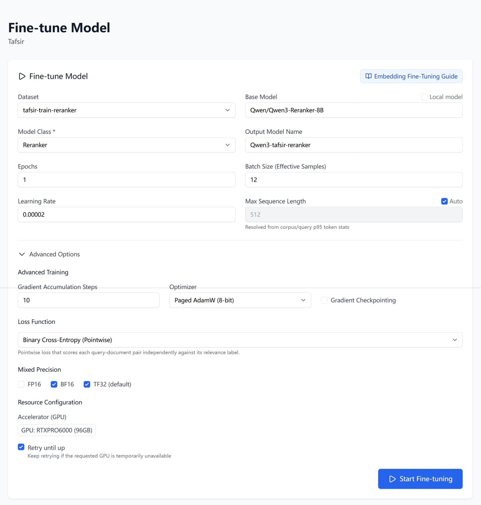
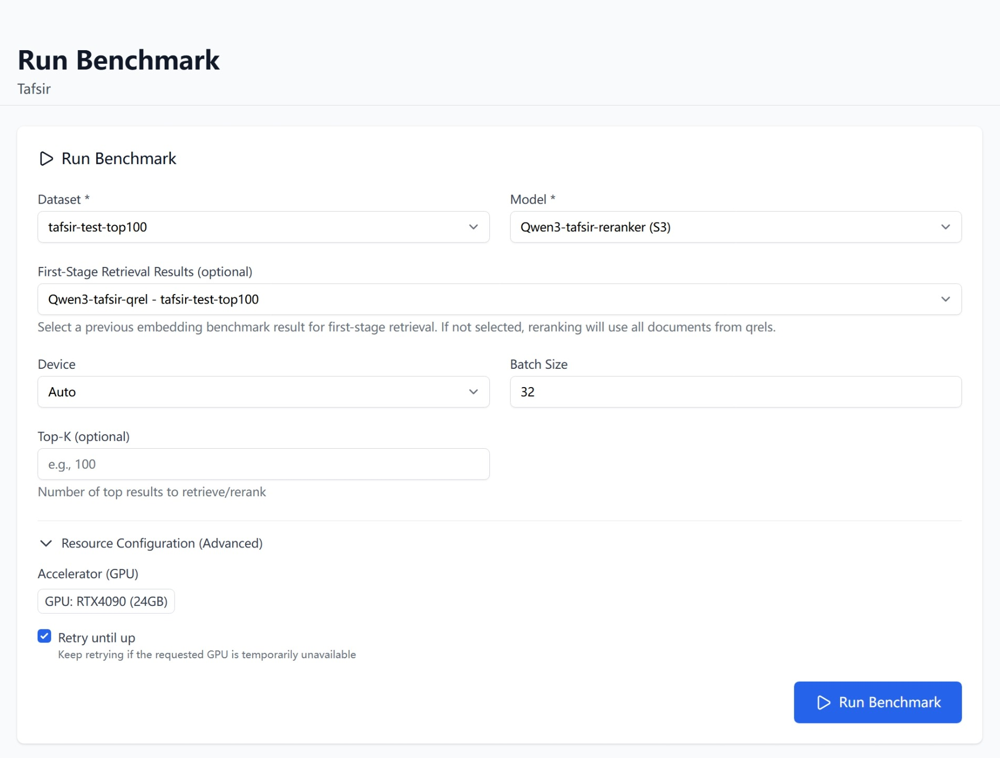
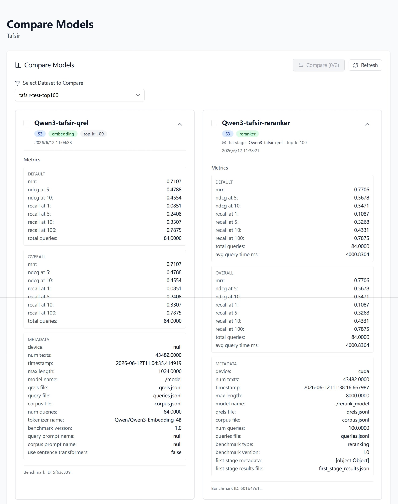

# How to fine-tune a rerank model

## 1. Introduction

A **reranker** scores a query and a document *together* and returns a single
relevance score. This makes it more accurate than an embedding model — which
encodes the query and document separately and compares vectors — but also far
slower, since it has to run once per query-document pair.

Because of that cost, a reranker is used as a **second stage**. An embedding
model first retrieves a shortlist of candidates (say the top 100), then the
reranker re-scores just that shortlist and reorders it. You get the recall of
fast vector search with the precision of a cross-encoder, only over a handful
of documents.

Fine-tuning adapts a base reranker to your own data so it ranks your domain's
candidates better than any off-the-shelf reranker. You give Tuner a dataset
and a base model; it trains and produces a new model that appears in your
**Model List**, ready to benchmark.

> **Tip — do you need a reranker?** Add one when a strong embedding model
> already retrieves the right documents but ranks them in the wrong order — the
> reranker fixes ordering within the shortlist. If the right documents are not
> being retrieved at all, improve the
> [embedding model](How-to-fine-tune-an-embedding-model) first; a reranker can
> only reorder what the first stage hands it.

**Before you start:** assemble a dataset on the **IR Datasets** page. A
reranker dataset **must include a relevance set (qrels)** — the reranker learns
from labelled query-document pairs, so this is required, not optional. If you do
not have a labelled dataset, see
[How to synthesize a dataset](How-to-synthesize-a-dataset).

## 2. Start a fine-tune job

Navigate to **Models → Fine-tune** (`/project/{id}/models/finetune`).

1. Choose your **Dataset** — it must have a relevance set.
2. Set the **Base Model** — a HuggingFace reranker (cross-encoder) identifier,
   for example `cross-encoder/ms-marco-MiniLM-L-6-v2`, `BAAI/bge-reranker-base`,
   or `Qwen/Qwen3-Reranker-0.6B`. To fine-tune a model already in this project
   instead, tick **Local model** and pick it from the dropdown.
3. Set **Model Class** to **Reranker**.
4. Give the result an **Output Model Name**.
5. Adjust the training settings if needed — the defaults are a good starting
   point. To switch the training **Loss**, open **Advanced Options** (see the
   tip below).
6. Pick a GPU under **Accelerator (GPU)**.
7. Click **Start Fine-tuning**.

The core fields:

| Field | Required | Default | Notes |
|---|---|---|---|
| **Dataset** | Yes | — | Must include a relevance set (qrels) |
| **Base Model** | Yes | — | A HuggingFace reranker ID, or a project model via **Local model** |
| **Model Class** | Yes | — | **Reranker** |
| **Output Model Name** | Yes | — | Name for the resulting model |
| **Epochs** | No | `3` | Passes over the dataset |
| **Batch Size (Effective Samples)** | No | `16` | Samples per training step |
| **Learning Rate** | No | `0.00002` | How fast the model updates |
| **Max Sequence Length** | No | `512` | Tick **Auto** to resolve it from your data |
| **Accelerator (GPU)** | Yes | RTX4090 | Pick the GPU in the **Select a GPU** dialog |
| **Retry until up** | No | On | Keep retrying if the chosen GPU is busy |

> **Tip — BCE or LambdaLoss?** The **Loss Function** dropdown under **Advanced
> Options** offers two losses that optimise different things, so pick by how
> your relevance labels look and what you want the reranker to do.
>
> - **Binary Cross-Entropy (Pointwise)** scores each query-document pair on its
>   own as relevant or not, ignoring the other candidates. It is simple, robust,
>   and trains fast, which makes it the safe default, especially with binary
>   (relevant / not-relevant) labels.
> - **LambdaLoss** is *listwise* — it looks at all of a query's candidates
>   together and optimises their relative order to improve a ranking metric
>   (NDCG) directly. It tends to rank better when ordering within the shortlist
>   is what matters and when you have graded relevance, at the cost of somewhat
>   heavier training.
>
> Start with **Binary Cross-Entropy (Pointwise)** — the default; switch to
> **LambdaLoss** if you have graded labels or if the ranking order within the
> candidates is the metric you care about most.

> **Note — a simpler form than embedding fine-tuning.** Choosing **Reranker**
> hides the embedding-only options: no **Mini-Batch Size**, and no
> **Matryoshka**. A reranker outputs a single score rather than a vector, so those embedding-specific
> controls do not apply.

The form still has a collapsed **Advanced Options** section — gradient
accumulation steps, optimizer, gradient checkpointing, the **Loss Function**
(see the tip above), and mixed precision (FP16 / BF16 / TF32). The defaults work
well; leave it collapsed unless you have a specific reason to change it.

> **Tip — hitting out-of-memory (OOM) errors?** If the job fails with a
> CUDA out-of-memory error, lower the **Batch Size (Effective Samples)** and
> start again — halve it until the job fits (for example `16` → `8` → `4`). To
> keep the effective batch size up while using less memory, raise **Gradient
> Accumulation Steps** under **Advanced Options** by the same factor, and enable
> **Gradient Checkpointing**. Picking a GPU with more memory
> under **Accelerator (GPU)** also helps.

## 3. Track the job and use your model

Fine-tuning runs as a background job — you will see "Fine-tuning job started
successfully!" and can follow it in the **Active Fine-tuning Jobs** card below
the form.

When it finishes, the new model appears under **Models → Model List**, listed
with the **Reranker** class. From there, benchmark it to confirm it improved on
your ranking.

## 4. Benchmark your reranker

A reranker is only ever a second stage, so its benchmark works differently from
an embedding benchmark. Go to **Benchmarks → Run Benchmark**
(`/project/{id}/benchmarks`), select your reranker under **Model**, and the form
reveals an extra field:

| Field | Required | Notes |
|---|---|---|
| **Dataset** | Yes | The dataset to score against |
| **Model** | Yes | Your fine-tuned reranker |
| **First-Stage Retrieval Results (optional)** | No | A previous embedding benchmark result to rerank |
| **Device** | No | **Auto**, **CPU**, or **CUDA (GPU)** |
| **Batch Size** | No | Defaults to `32` |
| **Top-K (optional)** | No | Number of top results to retrieve / rerank |

**First-Stage Retrieval Results** decides what the reranker re-scores:

- **Pick a previous embedding benchmark** to rerank that run's retrieved
  candidates. This mirrors production — an embedding model retrieves, the
  reranker reorders — and is the meaningful comparison: the reranked scores
  should beat the embedding run they sit on top of.
- **Leave it as "None (use qrels)"** to rerank all documents drawn from the
  qrels instead of a retrieved shortlist. This measures the reranker in
  isolation, without a first-stage model.

> **Tip — benchmark the embedding model first.** To see what the reranker adds,
> run an [embedding benchmark](How-to-choose-your-embedding-model) on the same
> dataset, then run the reranker benchmark with that result selected as the
> first stage. Comparing the two on **NDCG@10** and **MRR** shows exactly how
> much reordering the candidates helped.

Click **Run Benchmark**, track it under **Jobs** (`/project/{id}/jobs`), then
compare the results under **Benchmarks → Results** and **Compare Models** — see
[How to choose your embedding model](How-to-choose-your-embedding-model) for the
metrics table.

## 5. Compare the reranker against embedding-only

The reranker is worth keeping only if it ranks better than the embedding model
on its own. Open **Benchmarks → Compare Models**
(`/project/{id}/benchmarks/compare`), choose your dataset, and put the two runs
side by side:

- the **embedding-only** run — the first-stage retrieval on its own; and
- the **reranker** run — the same retrieval re-scored by your reranker.

The reranker run should win on the ranking-sensitive metrics — **NDCG@10** and
**MRR** above all, since reordering the shortlist is exactly what a reranker
does. **Recall@10** typically rises too: when the first stage retrieves a deep
shortlist (a high **Top-K**, say 100), the reranker promotes relevant documents
from ranks 11–100 up into the top 10. What it *cannot* change is recall at the
full first-stage depth — **Recall@100** here is capped by what the embedding
model retrieved, since the reranker only reorders those candidates and can never
surface a document the first stage missed. If the reranker does not beat
embedding-only on NDCG@10 and MRR, it is not earning its added latency — revisit
the training data or the base model before putting it into production.

