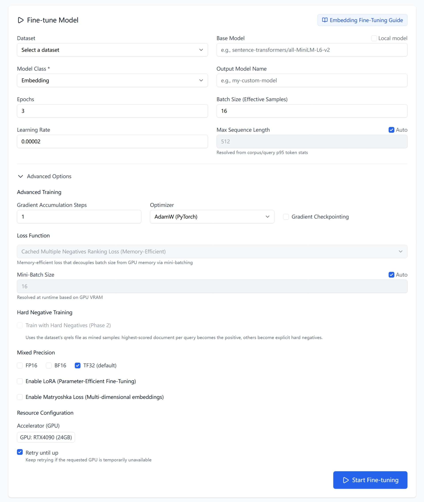
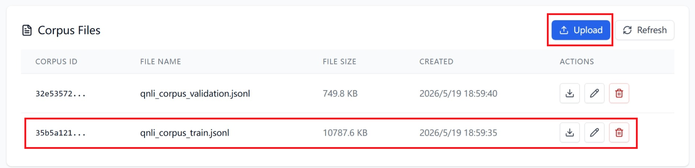
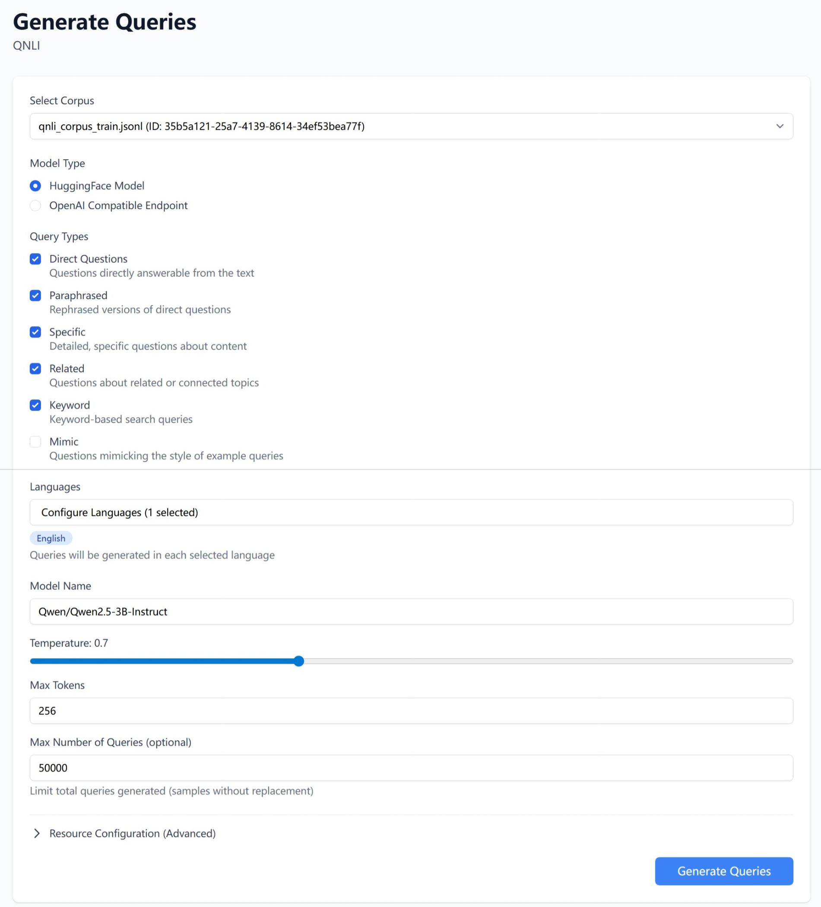
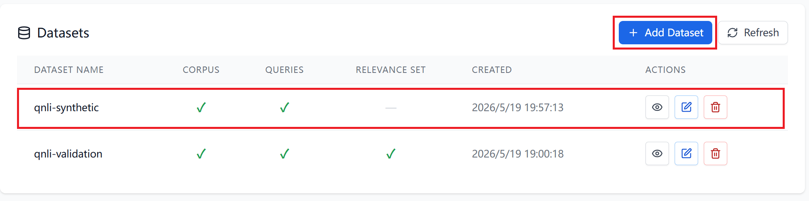
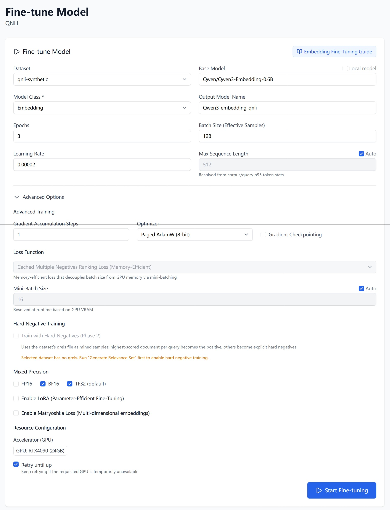
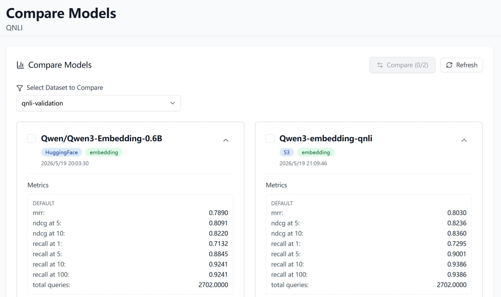

# How to fine-tune an embedding model

## 1. Introduction

Fine-tuning adapts a base embedding model to your own data, so it retrieves
better on your domain than any off-the-shelf model. You give Tuner a dataset
and a base model; it trains and produces a new model that appears in your
**Model List**, ready to benchmark.

> **Tip — do you have enough data?** Fine-tuning needs a substantial corpus to
> beat a good off-the-shelf model. As a rough guide, aim for at least 10,000
> unique chunks after deduplication — the more, the better. With a smaller
> corpus you are usually better off
> [choosing a strong existing model](How-to-choose-your-embedding-model)
> instead.

**Before you start:** assemble a dataset on the **IR Datasets** page. If you do
not have a labelled dataset, see
[How to synthesize a dataset](How-to-synthesize-a-dataset).

## 2. Start a fine-tune job

Navigate to **Models → Fine-tune** (`/project/{id}/models/finetune`).

1. Choose your **Dataset**.
2. Set the **Base Model** — a HuggingFace model identifier (for example,
   `sentence-transformers/all-MiniLM-L6-v2`). To fine-tune a model already in
   this project instead, tick **Local model** and pick it from the dropdown.
3. Set **Model Class** to **Embedding**.
4. Give the result an **Output Model Name**.
5. Adjust the training settings if needed — the defaults are a good starting
   point.
6. Pick a GPU under **Accelerator (GPU)**.
7. Click **Start Fine-tuning**.

The core fields:

| Field | Required | Default | Notes |
|---|---|---|---|
| **Dataset** | Yes | — | The dataset to train on |
| **Base Model** | Yes | — | A HuggingFace model ID, or a project model via **Local model** |
| **Model Class** | Yes | — | **Embedding** |
| **Output Model Name** | Yes | — | Name for the resulting model |
| **Epochs** | No | `3` | Passes over the dataset |
| **Batch Size (Effective Samples)** | No | `16` | Samples per training step |
| **Learning Rate** | No | `0.00002` | How fast the model updates |
| **Max Sequence Length** | No | `512` | Tick **Auto** to resolve it from your data |
| **Accelerator (GPU)** | Yes | RTX4090 | Pick the GPU in the **Select a GPU** dialog |
| **Retry until up** | No | On | Keep retrying if the chosen GPU is busy |

The form also has a collapsed **Advanced Options** section — optimizer, mixed
precision (FP16 / BF16 / TF32), gradient checkpointing, **LoRA**
parameter-efficient fine-tuning, and **Matryoshka** multi-dimensional
embeddings. The defaults work well; leave it collapsed unless you have a
specific reason to change it. For a deeper walkthrough, open the **Embedding
Fine-Tuning Guide** button on the form.

## 3. Track the job and use your model

Fine-tuning runs as a background job — you will see "Fine-tuning job started
successfully!" and can follow it in the **Active Fine-tuning Jobs** card below
the form.

When it finishes, the new model appears under **Models → Model List**. From
there, benchmark it against other models to confirm it improved — see
[How to choose your embedding model](How-to-choose-your-embedding-model).

## 4. Example: fine-tune an embedding model for QNLI

This worked example takes QNLI from raw documents all the way to a fine-tuned
model. Each step links to the recipe that covers it in full.

### Step 1 — Upload the training corpus

Create a project and upload your QNLI corpus on **Files → Corpus Files**. The
corpus is a JSONL file of chunks — see
[How to choose your embedding model](How-to-choose-your-embedding-model) for the
upload steps and schema.

A ready-made corpus is available —
[qnli_corpus_train.zip](assets/how-to-fine-tune-an-embedding-model/qnli_corpus_train.zip).
Unpack it and upload the corpus `.jsonl` file.

### Step 2 — Generate synthetic queries

QNLI ships with its own training queries, but here we generate synthetic ones
to demonstrate Tuner's query generation. On **Generate → Generate Queries**,
select the QNLI corpus and run the job — see
[How to synthesize a dataset](How-to-synthesize-a-dataset). The result is a
query file under **Files → Query Files**.

### Step 3 — Assemble the training dataset

On the **IR Datasets** page, click **Add Dataset**, combine the QNLI corpus
with the generated query file, and name it `qnli-synthetic`. A basic fine-tune needs only
a corpus and queries — no relevance set.

### Step 4 — Start the fine-tuning

Go to **Models → Fine-tune** and fill in the form:

| Field | Value |
|---|---|
| **Dataset** | `qnli-synthetic` |
| **Base Model** | `Qwen/Qwen3-Embedding-0.6B` |
| **Model Class** | **Embedding** |
| **Output Model Name** | `Qwen3-embedding-qnli` |
| **Epochs** | `3` (default) |
| **Batch Size (Effective Samples)** | `128` |
| **Learning Rate** | `0.00002` (default) |
| **Max Sequence Length** | **Auto** — QNLI sentences are short |
| **Optimizer** | Paged AdamW 8-bit — under **Advanced Options** |
| **BF16** | Checked — under **Advanced Options** |

> **Tip — batch size, optimizer, and mixed precision:** These three settings
> work together to train a larger model efficiently.
>
> - **Batch size** — embedding models learn from in-batch negatives, so a
>   bigger batch (here `128`) gives more negatives per step and usually better
>   quality, at the cost of more GPU memory.
> - **Optimizer** — **Paged AdamW 8-bit** keeps optimizer state in 8-bit and
>   pages it to host memory, freeing GPU memory so the large batch fits.
> - **Mixed precision** — **BF16** roughly halves memory use and speeds up
>   training, with a wider numeric range than FP16. Use it on modern GPUs.

Pick a GPU under **Accelerator (GPU)** and click **Start Fine-tuning**.

### Step 5 — Run the benchmark

Evaluate the fine-tuned model on held-out data, not the dataset it trained on.
When `Qwen3-embedding-qnli` appears in **Models → Model List**, benchmark it on
the `qnli-validation` dataset — a QNLI validation set kept separate from
training.

Compare its scores against the baseline results demonstrated in
[How to choose your embedding model](How-to-choose-your-embedding-model), which
benchmarks off-the-shelf models on the same QNLI validation set. The fine-tuned
model should score higher on NDCG@10 and Recall@10.

