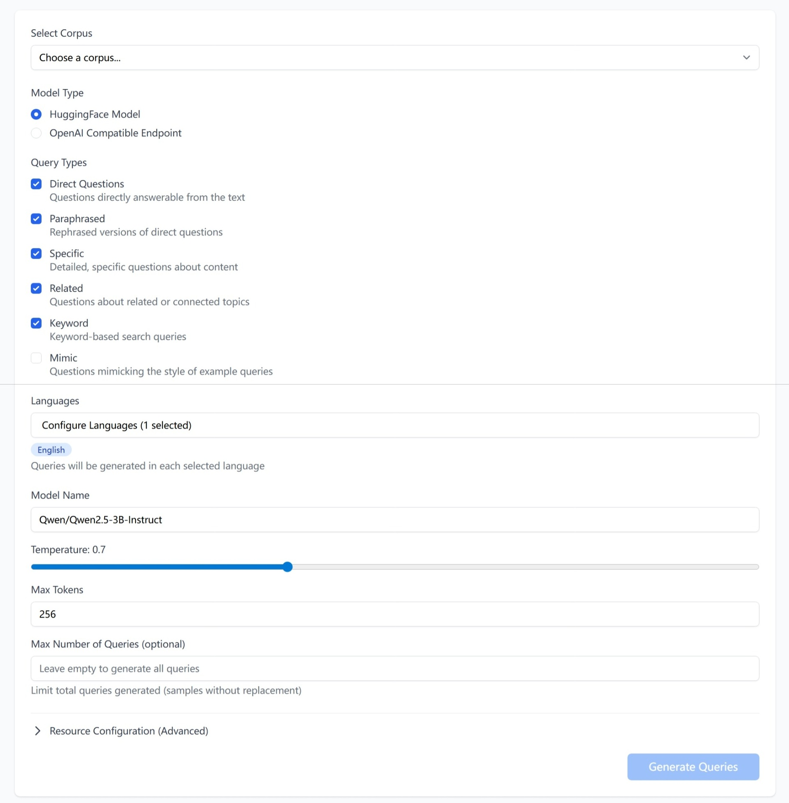
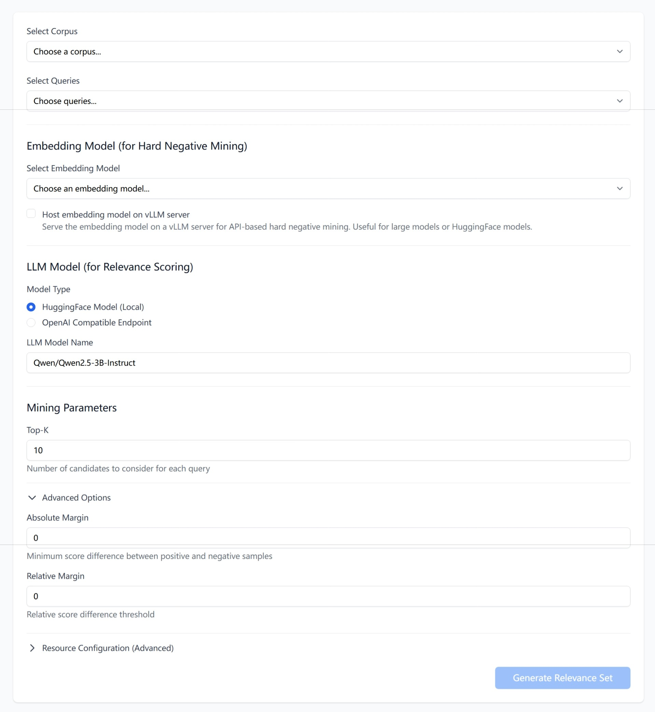

# How to synthesize a dataset

Benchmarking or fine-tuning needs a **labelled dataset** — queries paired with
the chunks that answer them. If you have a corpus but no labels, Tuner can
synthesize the rest: an LLM reads your corpus to write realistic queries, then
scores which chunks are relevant to each one.

This recipe has two steps:

1. **Generate queries** from your corpus.
2. **Generate a relevance set** (QREL) that links those queries to relevant
   chunks.

Each step produces a file in your project's **Files** section. Together with
the corpus, they form a dataset you can assemble on the **IR Datasets** page.

**Before you start:** upload a corpus to your project (the **Corpus Files**
page) — both steps generate from an existing corpus.

## 1. Generate queries

Navigate to **Generate → Generate Queries** (`/project/{id}/generate/queries`).

1. Under **Select Corpus**, choose the corpus to generate queries from.
2. Pick one or more **Query Types** — the kinds of queries to create (see
   below).
3. Choose the LLM that writes the queries: set a **Model Type** and enter the
   **Model Name**.
4. Adjust the optional generation settings if needed.
5. Click **Generate Queries**.

The form's main fields:

| Field | Required | Default | Notes |
|---|---|---|---|
| **Select Corpus** | Yes | — | The corpus to generate from |
| **Query Types** | Yes (≥1) | Direct Questions, Paraphrased, Specific, Related, Keyword | The kinds of queries to generate |
| **Model Type** | Yes | **HuggingFace Model** | Or **OpenAI Compatible Endpoint** (set API URL + key) |
| **Model Name** | Yes | `Qwen/Qwen2.5-3B-Instruct` | The LLM that writes the queries |
| **Languages** | No | English | Set via **Configure Languages** |
| **Temperature** | No | `0.7` | Higher values give more varied queries |
| **Max Tokens** | Yes | `256` | Token budget per query |
| **Max Number of Queries** | No | All | Cap the total; leave empty to generate from every chunk |

**Query Types** control the style of the generated questions:

- **Direct Questions** — questions directly answerable from the text.
- **Paraphrased** — rephrased versions of direct questions.
- **Specific** — detailed, specific questions about the content.
- **Related** — questions about related or connected topics.
- **Keyword** — keyword-based search queries.
- **Mimic** — questions that mimic the style of example queries. Selecting it
  reveals a **Select Example Queries** field, which then becomes required.

> **Tip — sourcing Mimic examples:** **Mimic** copies the style of the example
> queries you give it, so they should look like your real traffic.
>
> - **Collect real user queries.** Your search history is the best source.
> - **A few go a long way.** Around 10 example queries is enough; the LLM
>   few-shots from them.
> - **Upload them first.** The examples must already exist as a query file in
>   your project before you can pick them under **Select Example Queries**.
>   **Example Corpus** is optional — provide it when you know which
>   chunk each query matched.

Generation runs as a background job — you will see "Query generation job
started successfully!" and can follow it in the **Active Query Generation
Jobs** card. When it finishes, the new query file appears under **Files →
Query Files**.

## 2. Generate the relevance set (QREL)

A relevance set labels which chunks are relevant to each query. Tuner builds it
in two stages: an **embedding model** retrieves candidate chunks for each query, then an **LLM** scores how relevant each candidate is.

Navigate to **Generate → Generate Relevance Set**
(`/project/{id}/generate/qrels`).

1. Under **Select Corpus** and **Select Queries**, choose the corpus and the
   query set to label — for example, the queries you generated in step 1.
2. Under **Embedding Model**, pick a model with
   **Select Embedding Model**.
3. Under **LLM Model (for Relevance Scoring)**, set the **Model Type** and
   **LLM Model Name** for the LLM that scores relevance.
4. Set **Top-K** under **Mining Parameters**, and tweak **Advanced Options** if
   needed.
5. Click **Generate Relevance Set**.

The form's main fields:

| Field | Required | Default | Notes |
|---|---|---|---|
| **Select Corpus** | Yes | — | The corpus the queries were generated from |
| **Select Queries** | Yes | — | The query set to label |
| **Select Embedding Model** | Yes | — | Retrieves candidate chunks per query |
| **Host embedding model on vLLM server** | No | Off | Useful for large or HuggingFace models |
| **Model Type** | Yes | **HuggingFace Model (Local)** | Or **OpenAI Compatible Endpoint** |
| **LLM Model Name** | Yes | `Qwen/Qwen2.5-3B-Instruct` | The LLM that scores relevance |
| **Top-K** | Yes | `10` | Candidate chunks considered per query |
| **Absolute Margin** | No | `0` | Advanced — minimum score gap between positive and negative samples |
| **Relative Margin** | No | `0` | Advanced — relative score difference threshold |

> **Tip — which embedding model to use:** This model mines the candidate
> chunks (hard negatives), so its quality shapes the relevance set.
>
> - **To get started, use a strong general-purpose model** — for example,
>   OpenAI's `text-embedding-3-large`. Better retrieval gives the LLM better
>   candidates to score.
> - **If you plan to fine-tune a specific model, mine with that model.** The
>   hard negatives then come from the model you will train —
>   fine-tuning corrects the chunks that model currently
>   confuses, which makes training more effective.

> **Tip — pick a capable scoring LLM:** This LLM is the judge of which chunks
> are relevant to each query — a stronger model has better judgement over the
> chunks and yields a cleaner relevance set.

> **Tip — balancing hard negative mining:** **Top-K** and the margins together
> control how hard — and how clean — the mined negatives are.
>
> - **Top-K** is how many candidate chunks the embedding model retrieves per
>   query. Larger values catch more relevant chunks and give more negatives to
>   choose from, but cost more LLM scoring and reach into lower-ranked, weaker
>   candidates.
> - **Absolute / Relative Margin** do not decide whether a chunk is a negative
>   — they set where the model *starts* taking negatives. Chunks scoring within
>   the margin of a positive are too close to call and are skipped; the model
>   only learns from negatives beyond that gap. A tight margin (the `0`
>   default) starts right next to the positive — the hardest negatives, but
>   borderline chunks risk being false negatives. A wider margin starts further
>   below, skipping the ambiguous zone for cleaner negatives at the cost of the
>   hardest ones.
> - Start with the defaults; widen the margins if relevant chunks are slipping
>   in as negatives, and raise Top-K only if good chunks are being missed.

Generation runs as a background job — you will see "Qrel generation job started
successfully!" and can follow it in the **Active Qrel Generation Jobs** card.
When it finishes, the new relevance set appears under **Files → Relevance Set
Files**.

---

With a corpus, a generated query file, and a generated relevance set, you have
a complete synthetic dataset. Assemble the three on the **IR Datasets** page
(**Add Dataset**), then use it to benchmark or fine-tune — see
[How to choose your embedding model](How-to-choose-your-embedding-model).
